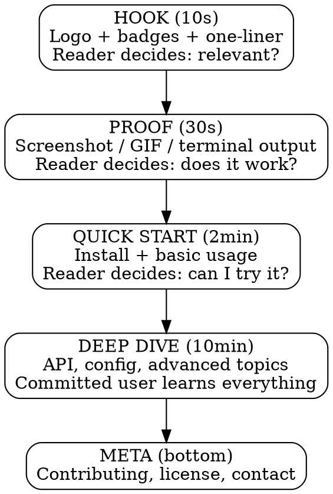

# Writing READMEs

## Overview

A README is a **cognitive funnel**. Every section either helps readers decide "is this for me?" or helps committed users succeed. Nothing else belongs.

Write top-down: broad first (10-second scan), deep last (10-minute study). Let readers bail at any depth with something useful.

## When to Use

- Creating a README for a new project
- Rewriting a weak or outdated README
- Reviewing a README for completeness
- Porting a README to a different project type

**Not for:** CLAUDE.md files (use `/init`), API reference docs (separate files), changelogs (use CHANGELOG.md).

## The Cognitive Funnel

Every great README follows this flow. Readers short-circuit at every level — each must stand alone.



**The rule:** Never put deep-dive content before the quick start. Never put meta before deep dive. Ordering is non-negotiable.

## Process

### 1. Detect Project Type

Read the project. Identify:
- **Library** — imported by other code (npm, PyPI, crate)
- **CLI tool** — invoked from terminal
- **Application** — run by end users (web app, mobile, desktop)
- **Monorepo** — multiple packages in one repo
- **Internal tool** — used by a specific team

### 2. Audit the Project

Before writing anything:
- Read package.json / Cargo.toml / pyproject.toml for metadata
- Scan src/ for the main entry point and key features
- Run the project if possible to understand what it does
- Identify the ONE thing that makes this project worth using

### 3. Write the Hook

**Required elements (in order):**
- Logo/banner (optional — skip for internal tools)
- Badges: 3-5 max. Build status, version, license. More is noise.
- **One-liner:** What it does AND why it matters. Not just what it is.

```markdown
<!-- ❌ BAD: Says what, not why -->
A React component library for data visualization.

<!-- ✅ GOOD: Says what AND why -->
Accessible data viz components that pass WCAG 2.1 AA out of the box.
```

The one-liner test: if someone reads only this sentence and nothing else, do they know whether this project is relevant to them?

### 4. Show Visual Proof

Immediately after the hook. This is the most skipped section — and the most important after the one-liner.

| Project type | Visual proof format |
|---|---|
| CLI tool | Terminal GIF or asciinema recording |
| Web app | Screenshot of the main UI |
| Library | Code snippet with output shown |
| API | curl example with response |
| Pipeline / multi-stage | Mermaid flowchart showing the data path |
| State machine / workflow | Mermaid stateDiagram showing transitions |
| Internal tool | Skip or minimal screenshot |

Keep it simple: one image/GIF/diagram showing the core use case. Not a gallery.

Mermaid renders natively on GitHub — no images to maintain, no external tools. Prefer it over static PNGs for anything structural.

### 4b. "Why This Exists" (optional)

For projects where the problem isn't obvious from the one-liner, add a short paragraph (3-5 sentences) explaining the problem this solves. Place it between visual proof and install. Skip for projects where the value prop is self-evident (e.g., a date formatting library).

### 5. Select Sections

Use this decision matrix. Include a section only if "yes."

| Section | Library | CLI | App | Internal |
|---|---|---|---|---|
| Logo/banner | if exists | if exists | yes | no |
| Badges (3-5) | yes | yes | yes | no |
| One-liner | yes | yes | yes | yes |
| Visual proof | code output | terminal GIF | screenshot | optional |
| Features list | if >3 | if >3 | yes | brief |
| Install | yes | yes | dev setup | yes |
| Quick start | yes | yes | link to demo | yes |
| API reference | yes (longest section) | flags/commands | no | as needed |
| Configuration | if configurable | if configurable | yes | yes |
| Architecture | no (use separate doc) | no | no | optional |
| Diagrams (Mermaid) | if multi-stage | if pipeline/flow | if architecture matters | if onboarding aid |
| Contributing | yes | yes | yes | no |
| License | required | required | required | no |
| TOC | if >100 lines | if >100 lines | if >100 lines | if >100 lines |
| "Why this exists" | if non-obvious | if non-obvious | if non-obvious | no |

**TOC is mandatory over 100 lines.** No exceptions. Don't rationalize "the headers are clear enough" or "it's well-structured." If the line count exceeds 100, add a TOC. Count the lines, don't estimate.

**Rule of separation:** If any section exceeds 80 lines, move it to a separate doc and link to it. READMEs are entry points, not encyclopedias.

### 6. Write Each Section

**Install section:**
- Shortest working path first (one command if possible)
- Additional methods (from source, Docker, etc.) in collapsible `<details>` blocks
- Copy-paste ready — every command must work verbatim

**Quick start / Usage:**
- Show the simplest possible example that demonstrates value
- Include expected output (people need to know it's working)
- Build complexity gradually: basic → intermediate → "see docs for advanced"

**API / Reference:**
- Tables beat prose for scanning
- Group by use case, not alphabetically
- For >20 items, link to separate docs

**Contributing:**
- How to report bugs
- How to submit PRs
- Dev setup if different from install

### 6b. Diagrams (Mermaid — when they earn their space)

A diagram belongs in a README when prose would force the reader to build a mental model that a picture gives them instantly. If a sentence explains it, skip the diagram.

**When to include a diagram:**

| Signal | Diagram type | Example |
|---|---|---|
| Data passes through 3+ stages | `flowchart LR` | Input → Parse → Transform → Output |
| System has distinct state transitions | `stateDiagram-v2` | Idle → Running → Paused → Stopped |
| Multiple actors interact over time | `sequenceDiagram` | Client → API → Queue → Worker |
| Project has 3+ components that connect | `flowchart TD` | Frontend → Gateway → Service A / Service B |
| Request/response lifecycle matters for usage | `sequenceDiagram` | Auth flow, webhook delivery |

**When to skip:**
- Single-purpose libraries (the code snippet IS the diagram)
- Linear install-and-run tools (the quick start covers it)
- When the diagram would just restate the features list as boxes

**Placement rules:**
- Architecture/flow overview → place after "Why this exists" or at the top of Usage
- State diagrams → place in the section where state matters (usually Usage or API)
- Sequence diagrams → place where the interaction is described

**Writing good Mermaid in READMEs:**

```markdown
```mermaid
flowchart LR
    A[Raw Input] --> B[Parser]
    B --> C{Valid?}
    C -->|yes| D[Transform]
    C -->|no| E[Error Report]
    D --> F[Output]
`` `
```

Rules:
- Keep nodes to 8 or fewer per diagram. More than that → split into multiple or link to docs.
- Label edges when the relationship isn't obvious from context.
- Use `LR` (left-right) for pipelines/flows, `TD` (top-down) for hierarchies.
- No styling/theming in the README — let GitHub's default renderer handle it. Themed diagrams break in dark mode or different renderers.
- Test that it renders on GitHub before shipping. Paste it in a gist or PR comment first if unsure.

**One diagram max in the visual proof section.** Additional diagrams go in Usage or Architecture subsections. A README with three Mermaid blocks at the top reads like a textbook, not a landing page.

### 7. Verify

Run this checklist after writing:

- [ ] One-liner explains what AND why
- [ ] Stranger can install and run in <5 minutes from README alone
- [ ] Every code block runs if pasted verbatim
- [ ] No empty or placeholder sections
- [ ] No broken links
- [ ] License present (public projects)
- [ ] TOC present if >100 lines (count with `wc -l`, don't estimate)
- [ ] Visual proof matches current version
- [ ] No section exceeds 80 lines (move to separate doc)
- [ ] No repeated content across sections
- [ ] Changelog is NOT in README (use CHANGELOG.md)
- [ ] No full file tree listing (goes stale)
- [ ] Mermaid diagrams render correctly (test in a gist or PR comment)
- [ ] No diagram restates what prose already explains clearly

## Common Mistakes

| Mistake | Fix |
|---|---|
| Changelog in README | Move to CHANGELOG.md. README is for new readers, not existing users. |
| "What" without "why" | One-liner must answer: why should I care? |
| No visual proof | Add screenshot/GIF/output after the one-liner. First thing readers look for. |
| Reference docs inline | If >80 lines, link to separate file. README is an entry point. |
| Badge overload | 3-5 badges max. Each must answer a question the reader actually has. |
| Repeated content | Each fact appears once. Don't document the same feature in 3 sections. |
| Full file tree | Goes stale immediately. Describe architecture in prose or link to docs. |
| Use cases buried at bottom | If they help explain the value, move them near the top (after quick start). |
| Prose where code works | Show a code example instead of describing what the code does. |
| Platform-specific assumptions | State requirements (OS, runtime version, dependencies) explicitly. |
| No architecture diagram for multi-component project | Add a Mermaid flowchart if the project has 3+ interacting parts. Readers shouldn't have to read all the source to understand the shape. |
| Diagram overload | One diagram max in visual proof. Additional diagrams go in Usage/Architecture sections, and only if they clarify something prose can't. |

## Quick Reference: Section Order

```
1. Logo/banner (optional)
2. Badges (3-5)
3. One-liner (what + why)
4. Visual proof (screenshot/GIF/output)
5. "Why this exists" (if problem non-obvious)
6. TOC (mandatory if >100 lines)
7. Features (brief bullet list)
8. Install (shortest path first, alternatives in <details>)
9. Quick start (simplest example with expected output)
10. Usage / API (build complexity)
11. Configuration (if applicable)
12. Contributing
13. License
```

This order matches the cognitive funnel: hook → proof → try it → learn it → help build it.
