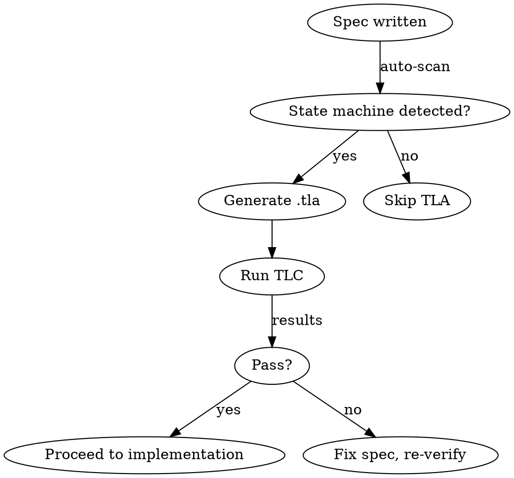

# TLA+ State Machine Verification

Formal verification of state machines using TLA+ model checking. Catches impossible states, deadlocks, and invariant violations that testing misses — because TLC explores *every* reachable state, not a sample.

## When to Use

- **During planning** (`/interactive-planning`): Spec describes a state machine → generate TLA+ spec → verify before coding
- **After implementation**: Swift/TS code has state enums → extract → verify → find bugs
- **Design review**: Validate that a state machine design is sound before committing to it

## Commands

### `/tla-spec generate <source>`

Extract state machines and generate `.tla` + `.cfg` files.

**Source types:**
- `plan` — read the current interactive-planning spec files for state machines
- `<file-path>` — extract from a Swift/TypeScript source file
- `<description>` — generate from a natural language description

**Steps:**
1. Parse source for state enums, transitions, guards, and invariants
2. Spawn `tla-verifier` agent to generate `.tla` module and `.cfg` config
3. Write files to `docs/tla/<machine-name>/`
4. Report: states found, transitions mapped, invariants defined

**Output structure:**
```
docs/tla/<machine-name>/
  <MachineName>.tla    # TLA+ module
  <MachineName>.cfg    # TLC configuration
  README.md            # Human-readable state diagram + invariant list
```

### `/tla-spec verify [machine-name]`

Run TLC model checker against a generated spec.

**Steps:**
1. Check TLA+ tools installed (`tlc` or `tla2tools.jar`). If missing, install via `brew install tlaplus` or download jar.
2. Spawn `tla-verifier` agent to run TLC
3. Parse TLC output for:
   - Invariant violations (with counterexample trace)
   - Deadlocks (states with no enabled transitions)
   - State space stats (states explored, distinct states, duration)
4. Report results. If violations found, show the exact action sequence that triggers them.

**Exit conditions:**
- All invariants hold + no deadlocks → PASS (print certificate)
- Violation found → FAIL (print counterexample trace + suggested fix)
- State explosion (>10M states) → WARN (suggest tighter domain bounds)

### `/tla-spec audit [path]`

Scan existing code for state machines, generate specs, verify them.

**Steps:**
1. Spawn `tla-verifier` agent to scan source files
2. Detect state enums + transition methods (pattern: enum with cases + methods that mutate/return the enum)
3. Generate `.tla` for each detected machine
4. Run TLC on each
5. Report: machines found, verification results, any drift from existing specs

### `/tla-spec drift [machine-name]`

Compare a planning-phase `.tla` spec against the implemented code.

**Steps:**
1. Read the spec from `docs/tla/<machine-name>/`
2. Extract the current state machine from source code
3. Diff: transitions in spec but not in code (missing implementation), transitions in code but not in spec (unplanned behavior)
4. Report drift with file:line references

## TLA+ Generation Rules

When generating `.tla` files, follow these constraints:

### State Variables
- One variable per state dimension (e.g., `balls`, `strikes`, `outs` — not a single compound `gameState`)
- Use sets for collections, integers for counts, strings for enum-like states

### Transitions
- Each action is a separate TLA+ operator
- Guard conditions go in the action body (IF/THEN or conjunction)
- UNCHANGED must list all variables not modified by the action

### Invariants
- Type invariant: variable domains (e.g., `balls \in 0..3`)
- Safety invariants: properties that must always hold (e.g., `strikes <= 2`)
- Custom invariants from user requirements

### Configuration (.cfg)
```
INIT Init
NEXT Next
INVARIANT TypeInvariant
INVARIANT SafetyInvariant
```

## Integration with Interactive Planning

When `/interactive-planning` produces specs that describe state machines:



The skill checks spec files for these patterns:
- Enum/state definitions with named cases
- Transition descriptions (arrows, "goes to", "transitions to")
- Guard conditions ("only if", "when", "unless")
- Invariants ("must always", "never", "at most")

## TLA+ Installation

TLC requires Java (already available on this machine).

```bash
# Option 1: Homebrew
brew install tlaplus

# Option 2: Direct jar download
curl -L -o /usr/local/lib/tla2tools.jar \
  https://github.com/tlaplus/tlaplus/releases/latest/download/tla2tools.jar
alias tlc="java -jar /usr/local/lib/tla2tools.jar"
```

## Example: StrikeZone GameState

Input (Swift):
```swift
enum SessionPhase { case setup, loading, active, demo, error(String) }
// recordBall() → balls > 3 → walk
// recordStrike() → strikes > 2 → strikeout
// recordFoul() → strikes < 2 → increment, else no-op
```

Output (TLA+):
```tla
---- MODULE GameState ----
EXTENDS Integers
VARIABLES balls, strikes, outs, inning, isTop

TypeInvariant == balls \in 0..3 /\ strikes \in 0..2 /\ outs \in 0..2
                 /\ inning \in 1..9 /\ isTop \in BOOLEAN

Init == balls = 0 /\ strikes = 0 /\ outs = 0 /\ inning = 1 /\ isTop = TRUE

RecordBall ==
    /\ balls < 3
    /\ balls' = balls + 1
    /\ UNCHANGED <<strikes, outs, inning, isTop>>

Walk ==
    /\ balls = 3
    /\ balls' = 0 /\ strikes' = 0
    /\ UNCHANGED <<outs, inning, isTop>>

Next == RecordBall \/ Walk \/ RecordStrike \/ Strikeout \/ RecordFoul
====
```
